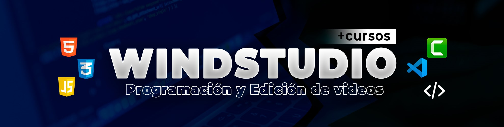

<h1><code>Hola! Me alegro de verte.</code></h1>

<code style="font-size: 20px"><strong>¡Bienvenido a mi perfil!</strong></code> 
Soy <strong>Juan Camilo R. Coral</strong>, Ingeniero de sistemas y creador de contenido educativo, mi objetivo es hacer que la programación sea accesible para todos. Transformo conceptos complejos en tutoriales prácticos y videos entretenidos por medio del canal <a href="https://www.youtube.com/@windstudio_"><code><strong>WindStudio</strong></code></a>, comparto trucos, consejos y proyectos para ayudarte a dominar las habilidades necesarias en este emocionante campo.

<h2><code>Tecnologías</code></h2>

 
 

<h2><code>Curso Básico de PHP SMARTY TEMPLATE</code></h2>

<table style="width:100%">
<tr>
<td>

</td>
<td>

</td>
<td>

</td>
</tr>

<tr>
<td>

</td>
<td>

</td>
<td>

</td>
</tr>

<tr>
<td>

</td>
<td>

</td>
<td>

</td>
</tr>

<tr>
<td>

</td>
</tr>

</table>

<h4>Puedes apoyarme haciendo <code>⭐ Star</code> en este repositorio o en los demás que estaré subiendo 🤩</h4>